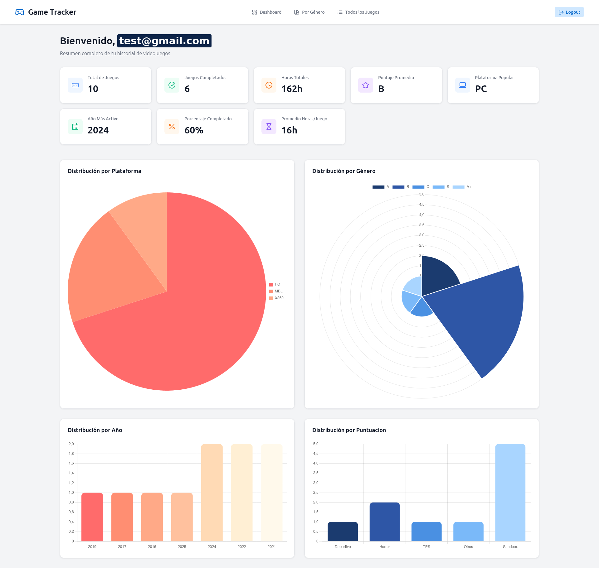

# Game Tracker App

## Descripción

Aplicación FullStack de visualizacion y gestion de una coleccion de juegos de cada persona. Frontend en Angular, backend en Spring Boot y base de datos PostgreSQL (Docker).



## Tecnologías utilizadas

- **Frontend:** Angular v20
- **Backend:** Spring Boot (Java)  
- **Base de datos:** PostgreSQL (Docker)  
- **Docker:** Docker Compose  

## Cómo levantar el proyecto

### Requisitos previos

- [Node.js](https://nodejs.org/)  
- [Angular CLI](https://angular.io/cli)  
- [Java 17+](https://adoptium.net/)  
- [Maven](https://maven.apache.org/)  
- [Docker](https://www.docker.com/) y Docker Compose  

### Backend

1. Ubicarse en la carpeta `backend/`  

2. Ejecuta:

```bash
docker compose up -d
```

Esto levantará el contenedor PostgreSQL con la base y los datos iniciales.

Luego ejecuta la aplicación Spring Boot:

```bash
mvn spring-boot:run
```

### Frontend

Ubicarse en la carpeta frontend/

- Instalar las dependencias:

```bash
npm install
```

- Levanta la app Angular:


```bash
ng serve
```
