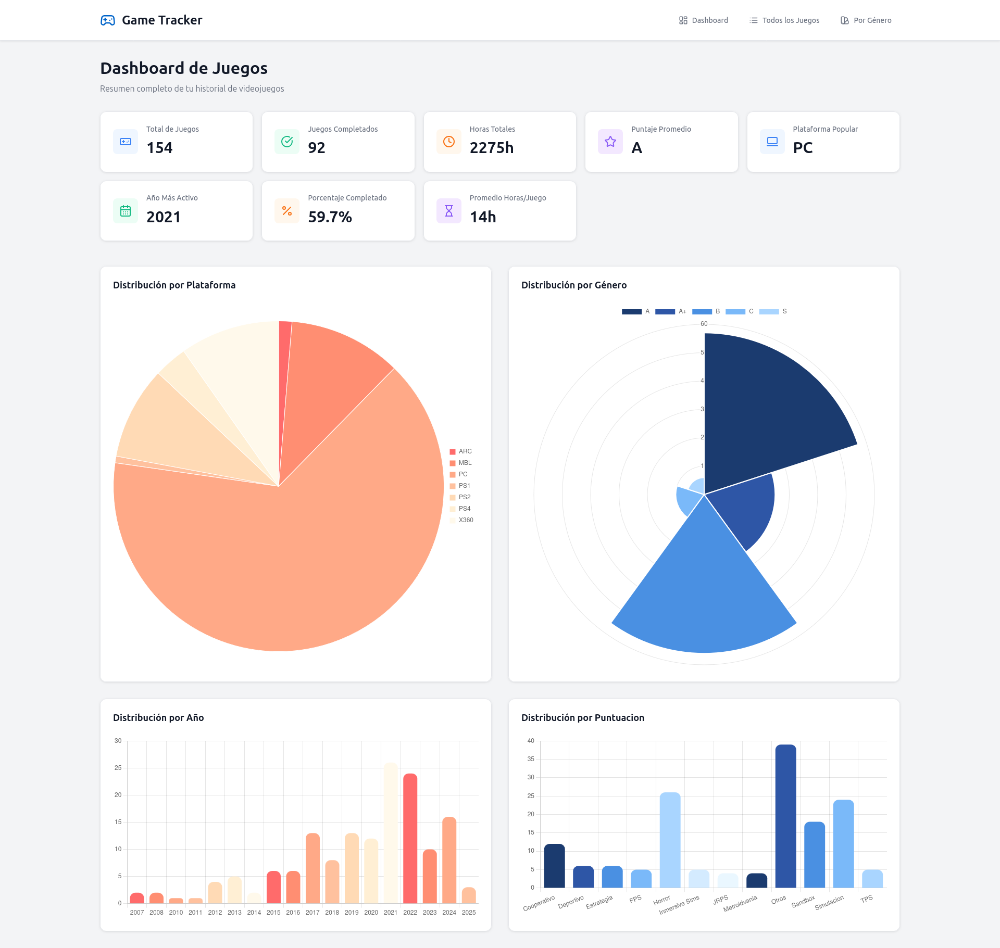

# Game Tracker App


## Descripción

Aplicación full stack para gestión y visualización de un coleccion de datos de juegos.  
Frontend en Angular, backend en Spring Boot y base de datos PostgreSQL (Docker).

---



---


## Tecnologías utilizadas

- **Frontend:** Angular  
- **Backend:** Spring Boot (Java)  
- **Base de datos:** PostgreSQL (Docker)  
- **Docker:** Docker Compose  

---

## Cómo levantar el proyecto

### Requisitos previos

- [Node.js](https://nodejs.org/)  
- [Angular CLI](https://angular.io/cli)  
- [Java 17+](https://adoptium.net/)  
- [Maven](https://maven.apache.org/)  
- [Docker](https://www.docker.com/) y Docker Compose  

---

### Backend

1. Ubicate en la carpeta `backend/`  

2. Ejecuta:

	```bash
	docker compose up -d
	```

Esto levantará el contenedor PostgreSQL con la base y los datos iniciales.

Luego ejecuta la aplicación Spring Boot:

```bash
	mvn spring-boot:run
```

### Frontend

Ubicate en la carpeta frontend/

- Instala dependencias:

```bash
npm install
```


- Levanta la app Angular:


```bash
ng serve
```

## Estructura del proyecto

mi-app-fullstack/
├── backend/
│   ├── db/
│   │   ├── init.sql
│   │   └── datos.csv
│   ├── src/
│   ├── pom.xml
│   └── docker-compose.yml
├── frontend/
│   ├── src/
│   ├── angular.json
│   └── .gitignore
├── README.md
└── .gitignore

